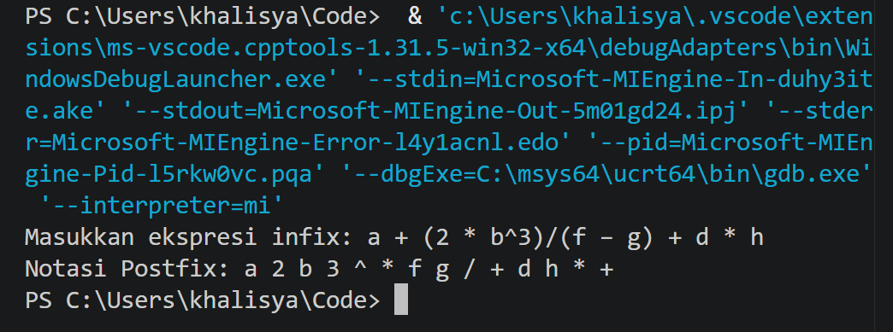

# ETS Struktur Data (2026)

**Nama:** Khalisya Zahra Putria Rahman

**NRP:** 5025251045  

**Kelas:** Struktur Data (D)

---

## Soal 1: Konsep Array

### --> Array adalah struktur data yang digunakan untuk menyimpan banyak nilai dengan tipe data yang sama dalam satu variabel. Setiap elemen dalam array dapat diakses secara langsung menggunakan indeksnya, yang biasanya dimulai dari angka 0.

### --> Array digunakan ketika kita perlu menyimpan banyak data yang memiliki kategori dan tipe yang sama tanpa harus membuat banyak variabel yang berbeda. Array sangat efisien untuk proses pencarian data menggunakan indeks dan proses iterasi (perulangan).

### Contoh Penggunaan dalam Aplikasi
1.  **Aplikasi dengan Image Processing (Photoshop / Kamera API):** Gambar digital direpresentasikan sebagai Array 2 Dimensi (matriks) di mana setiap elemen array berisi nilai piksel warna.
2.  **Keranjang Belanja (Shopee / Tokopedia):** Menyimpan daftar barang belanjaan pengguna dalam satu sesi, memungkinkan pengguna memilih atau menghapus barang di urutan acak.
3.  **Sistem Akademik:** Menyimpan daftar nilai 100 mahasiswa dalam satu mata kuliah untuk mempermudah perhitungan rata-rata.

---

## Soal 2: Simulasi Stack (Double Linked List)

Kondisi mula-mula Stack kosong. Berikut adalah gambaran visual perubahan Stack dan posisi pointer `Top` berdasarkan urutan perintah.

### Simbol & Representasi
* `[ P | Data | N ]`: Representasi satu Node. `P` = Pointer Previous, `N` = Pointer Next.
* `==>` : Pointer hubungan dua arah (*Double Linked*).
* `Top` : Pointer menunjuk ke elemen teratas.
* `NULL`: Menandakan ujung list.

### a. `Push(Top,60)`, `Push(Top,40)`, `Pop(Top,Item)`

1.  **Awal (Kosong)**
    ```text
    Top --> NULL
    ```
2.  **Push(Top, 60)**
    ```text
    Top --> [ NULL | 60 | NULL ]
    ```
3.  **Push(Top, 40)**
    ```text
            +---- Node Baru ---+       +---- Node Lama ---+
    Top --> | NULL | 40 | Next | ==> | Prev | 60 | NULL |
            +------------------+       +------------------+
    ```
4.  **Pop(Top, Item)** -> *Elemen 40 diambil, Top kembali ke 60.*
    ```text
    Top --> [ NULL | 60 | NULL ]
    (Item = 40)
    ```

### b. `Push(Top,25)`, `Pop(Top,Item)`, `Pop(Top,Item)`

1.  **Push(Top, 25)**
    ```text
    Top --> [ NULL | 25 | NULL ]
    ```
2.  **Pop(Top, Item)** -> *Stack menjadi kosong.*
    ```text
    Top --> NULL
    (Item = 25)
    ```
3.  **Pop(Top, Item)**
    ```text
    Top --> NULL
    Output: Kondisi UNDERFLOW (Error: Stack Kosong)
    ```

### c. `Pop(Top,Item)`, `Pop(Top,Item)`, `Push(Top,50)`

1.  **Pop(Top, Item)**
    ```text
    Top --> NULL
    Output: Kondisi UNDERFLOW
    ```
2.  **Pop(Top, Item)**
    ```text
    Top --> NULL
    Output: Kondisi UNDERFLOW
    ```
3.  **Push(Top, 50)**
    ```text
    Top --> [ NULL | 50 | NULL ]
    ```

---

## Soal 3: Notasi Postfix dan Stack C++

### Ekspresi Infix
`E = a + (2 * b^3)/(f − g) + d * h`

### Hasil Konversi Postfix
`a 2 b 3 ^ * f g - / + d h * +`

### Implementasi Source Code (C++)

```cpp
#include <iostream>
#include <stack>
#include <string>
#include <cctype>
using namespace std;

int precedence(char op){
    if(op == '^') return 3;
    else if(op == '*' || op == '/') return 2;
    else if(op == '+' || op == '-') return 1;
    else return 0;
}

bool isOperator(char c){
    return (c == '+' || c == '-' || c == '*' || c == '/' || c == '^');
}

string infixToPostfix(string infix){
    stack<char> st;
    string postfix = "";

    for(int i=0; i<infix.length(); i++){
        char c = infix[i];

        if(c == ' ') continue;

        if(isalnum(c)){
            postfix += c;
            postfix += " ";
        } 

        else if(c == '('){
            st.push(c);
        }

        else if(c == ')'){
            while(!st.empty() && st.top() != '('){
                postfix += st.top();
                postfix += " "; 
                st.pop();
            }
            if(!st.empty()) st.pop();
        }

        else if(isOperator(c)){
            while(!st.empty() && precedence(st.top()) >= precedence(c)){
                postfix += st.top();
                postfix += " ";
                st.pop();
            }
            st.push(c);
        }
    }

    while(!st.empty()){
        postfix += st.top();
        postfix += " ";
        st.pop();
    }

    return postfix;
}

int main(){
    string infix;
    cout << "Masukkan ekspresi infix (bisa dengan spasi): ";
    getline(cin, infix);
    
    string postfix = infixToPostfix(infix);
    cout << "Notasi Postfix: " << postfix << endl;
    
    return 0;
}
```

### Screenshot


---

## Soal 4: Simulasi Queue Linear standar (Array)

### Asumsi Ketentuan
- Maksimum Queue = 9 elemen (Array indeks 0 sampai 8)
- Kondisi Awal: Queue Kosong (Front = -1, Rear = -1)
- Logika Underflow/Reset: Jika antrian dihapus semua, penunjuk di-reset ke kondisi awal

### Representasi Visual (Plaintext)
- `[ ]` : Elemen kosong/NULL
- `F` : Posisi Pointer Front
- `R` : Posisi Pointer Rear

### 1. Kondisi Awal
```
Queue: [ ][ ][ ][ ][ ][ ][ ][ ][ ]
Index:  0  1  2  3  4  5  6  7  8
Status: Front = -1, Rear = -1 (Kosong)
```

### a: Tambah Angka 19
```
Queue: [19][ ][ ][ ][ ][ ][ ][ ][ ]
Index:   0  1  2  3  4  5  6  7  8
         ^
       F,R
Status: Front = 0, Rear = 0
```

### b: Tambah Angka 7
```
Queue: [19][7 ][ ][ ][ ][ ][ ][ ][ ]
Index:   0  1  2  3  4  5  6  7  8
         ^  ^
         F  R
Status: Front = 0, Rear = 1
```

### c: Hapus 2 Angka
Hapus 19 (Front=1), Hapus 7 (Front=2). Front > Rear, Lakukan Reset.
```
Queue: [ ][ ][ ][ ][ ][ ][ ][ ][ ]
Index:  0  1  2  3  4  5  6  7  8
Status: Front = -1, Rear = -1 (Reset/Kosong)
```

### d: Tambah Angka 40
```
Queue: [40][ ][ ][ ][ ][ ][ ][ ][ ]
Index:   0  1  2  3  4  5  6  7  8
         ^
       F,R
Status: Front = 0, Rear = 0
```

### e: Hapus 3 Angka
Hapus ke-1: Angka 40 dihapus (Queue Kosong, Reset)  
Hapus ke-2 & ke-3: **UNDERFLOW**
```
Queue: [ ][ ][ ][ ][ ][ ][ ][ ][ ]
Index:  0  1  2  3  4  5  6  7  8
Status: Front = -1, Rear = -1 (Kosong)
```

### f: Tambah Angka 18
```
Queue: [18][ ][ ][ ][ ][ ][ ][ ][ ]
Index:  0  1  2  3  4  5  6  7  8
         ^
       F,R
Status: Front = 0, Rear = 0
```

---

## Soal 5: Studi Kasus Antrian Layanan Akademik

### 1. Penjelasan Struktur Data Queue dalam Sistem

Sistem ini menggunakan **Queue linear dengan prinsip FIFO** (First In First Out).

- **Enqueue:** Saat mahasiswa mengambil nomor antrian, datanya dimasukkan ke posisi paling belakang (Rear/Tail).
- **Dequeue:** Petugas selalu memanggil mahasiswa yang berada di posisi paling depan (Front/Head).

Hal ini menjamin keadilan di mana mahasiswa yang datang lebih awal mutlak akan dilayani lebih awal.

### 2. Algoritma

#### Enqueue (Menambahkan Mahasiswa)
1. Cek apakah antrian penuh (`Rear == Maksimal - 1`)
2. Jika penuh, tampilkan pesan "Antrian Penuh"
3. Jika tidak penuh:
   - Jika ini data pertama (`Front == -1`), jadikan `Front = 0`
   - Tambahkan nilai `Rear` sebesar 1 (`Rear = Rear + 1`)
   - Masukkan nama mahasiswa ke indeks `Queue[Rear]`

#### Dequeue (Melayani Mahasiswa)
1. Cek apakah antrian kosong (`Front == -1` atau `Front > Rear`)
2. Jika kosong, tampilkan pesan "Tidak ada antrian"
3. Jika ada data:
   - Ambil/Tampilkan data di `Queue[Front]` sebagai mahasiswa yang sedang dilayani
   - Tambahkan nilai `Front` sebesar 1 (`Front = Front + 1`)
   - *(Opsional)* Jika `Front > Rear` setelah dequeue, reset `Front = -1`, `Rear = -1`

### 3. Implementasi Program (C++)

#### Part A: Implementasi Sederhana (Hardcoded Simulation)
Program ini mengimplementasikan fungsi dasar Queue dan menjalankan skenario simulasi secara langsung di fungsi `main()` tanpa input pengguna.

```cpp
#include<iostream>
#include<string>
using namespace std;

#define MAX 100
string queue[MAX];
int front = -1, rear = -1;

void enqueue(string nama){
    if(rear == MAX - 1) cout << "Antrian Penuh!" << endl;
    else{
        if(front == -1) front = 0; rear++;
        queue[rear] = nama;
        cout << nama << " masuk antrian." << endl;
    }
}

void dequeue(){
    if(front == -1 || front > rear) cout << "Antrian Kosong!" << endl;
    else cout << queue[front] << " sedang dilayani." << endl; front++;
}

void tampilkan(){
    if(front == -1 || front > rear) cout << "Antrian saat ini: Kosong" << endl;
    else{
        cout << "Antrian saat ini: ";
        for(int i = front; i <= rear; i++){
            cout << queue[i] << " ";
        }
        cout << endl;
    }
}

int main(){
    enqueue("Mahasiswa A");
    enqueue("Mahasiswa B");
    enqueue("Mahasiswa C");
    dequeue();
    enqueue("Mahasiswa D");
    tampilkan();
    
    return 0;
}
```

#### Part B: Implementasi Sistem Antrian Interaktif (Menu Berbasis)
Program ini menyediakan antarmuka menu interaktif yang memungkinkan pengguna untuk melakukan operasi Enqueue, Dequeue, dan Tampilkan secara dinamis melalui input terminal.

```cpp
#include<iostream>
#include<string>
using namespace std;

#define MAX 100
string queue[MAX];
int front = -1, rear = -1;

void enqueue(string nama){
    if(rear == MAX - 1) cout << "[!] Antrian Penuh!" << endl;
    else{
        if(front == -1) front = 0;
        rear++;
        queue[rear] = nama;
        cout << "[+] " << nama << " berhasil masuk ke antrian." << endl;
    }
}

void dequeue(){
    if(front == -1 || front > rear) cout << "[!] Antrian Kosong! Tidak ada mahasiswa yang bisa dipanggil." << endl;
    else cout << "[V] " << queue[front] << " dipanggil untuk dilayani." << endl; front++;
}

void tampilkan(){
    if(front == -1 || front > rear) cout << "Kondisi Antrian: Kosong" << endl;
    else{
        cout << "Kondisi Antrian saat ini: ";
        for(int i = front; i <= rear; i++){
            cout << queue[i];
            if(i<rear) cout << " -> ";
        }
        cout << endl;
    }
}

int main(){
    int pilihan;
    string nama_mhs;

    do{
        cout << "\n========== SISTEM ANTRIAN LAYANAN AKADEMIK ==========" << endl;
        cout << "1. Ambil Antrian (Enqueue)" << endl;
        cout << "2. Panggil Antrian (Dequeue)" << endl;
        cout << "3. Tampilkan Antrian Saat Ini" << endl;
        cout << "4. Keluar" << endl;
        cout << "Pilih menu (1-4): ";
        cin >> pilihan;

        switch(pilihan){
            case 1:
                cout << "Masukkan nama mahasiswa: ";
                cin.ignore();
                getline(cin, nama_mhs);
                enqueue(nama_mhs);
                break;
            case 2:
                dequeue();
                break;
            case 3:
                tampilkan();
                break;
            case 4:
                cout << "Program selesai." << endl;
                break;
            default:
                cout << "[!] Pilihan tidak valid!" << endl;
        }
    } while(pilihan != 4);

    return 0;
}
```

### 4. Simulasi Proses

#### Mahasiswa A, B, C masuk antrian
- **Antrian (Queue):** `[A, B, C]`
- **Front** menunjuk ke A
- **Rear** menunjuk ke C

#### Mahasiswa pertama dilayani
- Sistem melakukan **Dequeue**
- A dikeluarkan dari antrian untuk dilayani petugas
- **Antrian tersisa:** `[B, C]`
- **Front** sekarang bergeser menunjuk ke B

#### Tambah mahasiswa D
- Sistem melakukan **Enqueue** untuk D
- **Antrian menjadi:** `[B, C, D]`
- **Rear** bergeser menunjuk ke D

#### Tampilkan kondisi antrian
- **Output sistem:** "Antrian saat ini: B, C, D"
- **Mahasiswa yang berada di Front** (yang akan dilayani berikutnya): B
