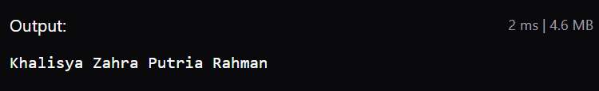
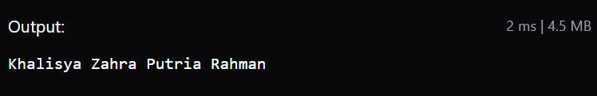
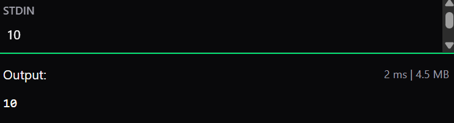
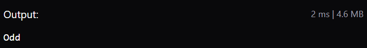
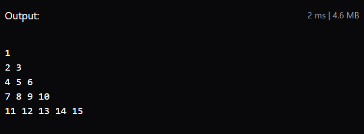
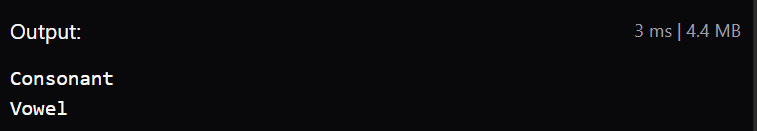
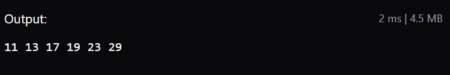
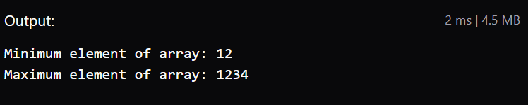
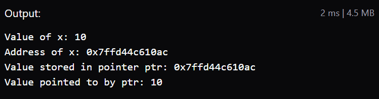
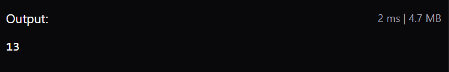

# Tugas Struktur Data - Week 2 (2026)

**Nama:** Khalisya Zahra Putria Rahman

**Repository:** [Link Source Code](https://github.com/leesasya/Struktur-Data/tree/main/Struktur%20Data/Week-2)

Repositori ini berisi kumpulan implementasi dasar pemrograman menggunakan C++ untuk mata kuliah Struktur Data. Terdapat 11 program sederhana yang mendemonstrasikan fungsi I/O, percabangan, perulangan, pembuatan fungsi, hingga penggunaan array, pointer, dan string.

---

## 1. C++ Hello World!

**Deskripsi:** Program paling dasar dalam C++ untuk mencetak teks standar ke layar menggunakan perintah `cout`.

```cpp
#include<iostream>
using namespace std;

int main(){
    cout << "Hello World!";
    return 0;
}

```

**Output:**
```txt
Hello World!
```
---

## 2. C++ cout

**Deskripsi:** Penggunaan fungsi `cout` pada *library* `iostream` untuk menampilkan tipe data *string* (nama lengkap) ke dalam konsol.

```cpp
#include<bits/stdc++.h>
using namespace std;

int main(){
    cout << "Khalisya Zahra Putria Rahman";
    return 0;
}

```

**Output:**

---

## 3. C++ puts()

**Deskripsi:** Penggunaan fungsi `puts()` bawaan C untuk mencetak string. Berbeda dengan `cout`, fungsi `puts()` otomatis menambahkan baris baru (*newline*) di akhir output.

```cpp
#include<bits/stdc++.h>
using namespace std;

int main(){
    puts("Khalisya Zahra Putria Rahman");
    return 0;
}

```

**Output:**

---

## 4. C++ cin

**Deskripsi:** Implementasi fungsi input `cin` untuk menerima masukan nilai dari pengguna dan menyimpannya ke dalam variabel integer, lalu menampilkannya kembali.

```cpp
#include<iostream>
using namespace std;

int main(){
    int i;
    cin >> i;
    cout << i;
    return 0;
}

```

**Output:**

---

## 5. C++ Branching - Odd/Even

**Deskripsi:** Program percabangan menggunakan `if-else` untuk mengecek operasi modulus. Jika bilangan habis dibagi dua, maka bernilai genap (*Even*), sebaliknya ganjil (*Odd*).

```cpp
#include<bits/stdc++.h>
using namespace std;

int main(){
    int n = 11;
    if(n % 2 == 0) cout << "Even";
    else cout << "Odd";
    return 0;
}

```

**Output:**

---

## 6. C++ Looping - Number Pattern

**Deskripsi:** Penggunaan perulangan bersarang (*nested loop*) dengan `for` untuk mencetak deret angka yang terus bertambah membentuk pola segitiga siku-siku.

```cpp
#include<iostream>
using namespace std;

int main(){
    int rows, columns, number=1, n=5;
    for(rows = 0; rows <= n; rows++){
        for(columns = 0; columns < rows; columns++){
            cout << number << " ";
            number++;
        }
        cout << "\n";
    }
    return 0;
}

```

**Output:**

---

## 7. C++ Function - Vowel / Consonant

**Deskripsi:** Pembuatan fungsi kustom `vowelOrConsonant()` dengan parameter karakter untuk mengecek apakah huruf yang dimasukkan merupakan huruf vokal (A, I, U, E, O) atau konsonan.

```cpp
#include<iostream>
using namespace std;

void vowelOrConsonant(char x){
    if(x == 'a' || x == 'i' || x == 'u' || x == 'e' || x == 'o' ||
    x == 'A' || x == 'I' || x == 'U' || x == 'E' || x == 'O')
    cout << "Vowel" << endl;
    else cout << "Consonant" << endl;
}

int main(){
    vowelOrConsonant('c');
    vowelOrConsonant('E');
    return 0;
}

```

**Output:**

---

## 8. C++ Function - Prime Numbers

**Deskripsi:** Implementasi dua fungsi: `isPrime()` untuk mengembalikan nilai *boolean* dari pengecekan bilangan prima, dan `findPrime()` untuk mencari serta mencetak daftar bilangan prima di dalam batas rentang nilai tertentu.

```cpp
#include<stdbool.h>
#include<stdio.h>

bool isPrime(int n){
    if(n <= 1) return false;
    for(int i=2; i<n; i++){
        if(n%i == 0) return false;
    }
    return true;
}

void findPrime(int l, int r){
    bool found = false;
    for(int i=l; i<=r; i++){
        if(isPrime(i)){
            printf("%d ", i);
            found = true;
        }
    }
    if(!found){
        printf("No prime numbers found in the given range.");
    }
}

int main(){
    int l = 10, r = 30;
    findPrime(l, r);
    return 0;
}

```

**Output:**

---

## 9. C++ Array

**Deskripsi:** Penggunaan tipe data kumpulan (*Array*) beserta fungsi untuk mencari elemen dengan nilai terkecil (`getMin`) dan terbesar (`getMax`).

```cpp
#include<bits/stdc++.h>
using namespace std;

int getMin(int arr[], int n){
    int res = arr[0];
    for(int i=1; i<n; i++){
        res = min(res, arr[i]);
        return res;
    }
}
int getMax(int arr[], int n){
    int res = arr[0];
    for(int i=1; i<n; i++){
        res = max(res, arr[i]);
        return res;
    }
}
int main(){
    int arr[] = {12,1234,45,67,1};
    int n = sizeof(arr)/sizeof(arr[0]);
    cout << "Minimum element of array: " << getMin(arr, n) << endl;
    cout << "Maximum element of array: " << getMax(arr, n);
    return 0;
}

```

**Output:**

---

## 10. C++ Pointer

**Deskripsi:** Konsep dasar *pointer* untuk menyimpan dan mengakses alamat memori dari suatu variabel. Variabel `ptr` menunjuk ke alamat memori variabel `var`.

```cpp
#include<iostream>
using namespace std;

int main(){
    int var=10;
    int* ptr = &var;

    cout << "Value of x: " << var << endl;
    cout << "Address of x: " << &var << endl;
    cout << "Value stored in pointer ptr: " << ptr << endl;
    cout << "Value pointed to by ptr: " << *ptr << endl;
    
    return 0;
}

```

**Output:**

---

## 11. C++ String

**Deskripsi:** Manipulasi struktur data `string` menggunakan fungsi bawaan `.size()` untuk menghitung total jumlah karakter yang ada di dalam teks.

```cpp
#include<iostream>
#include<string.h>
using namespace std;

int main(){
    string str = "GeeksforGeeks";
    cout << str.size() << endl;
    return 0;
}

```

**Output:**

---
